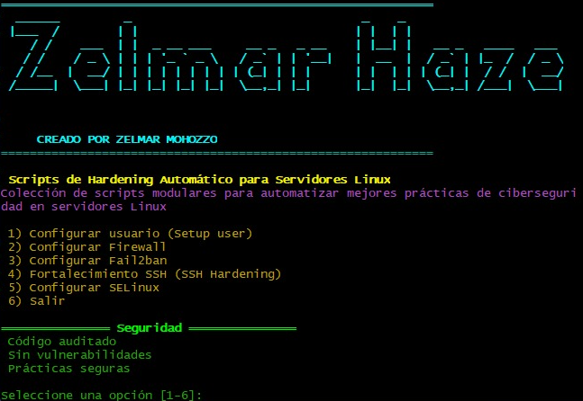

# linux-hardening-suite
Las mejores prácticas de hardening de servidores Linux, aumentando su seguridad desde el primer boot. Ideal para equipos DevSecOps, entornos de staging y producción segura

# 🛡️ Linux Hardening Scripts

> **Desarrollado por Zelmar Mohozzo**  
> 🧠 Cybersecurity Specialist & Developer  
> 🧪 Proyecto creado durante mi tiempo en **Code Society** para testing de proyectos internos

---

## 🎯 Propósito

Esta colección de scripts tiene como objetivo automatizar las mejores prácticas de **hardening de servidores Linux**, aumentando su seguridad desde el primer boot. Ideal para equipos DevSecOps, entornos de staging y producción segura.

---

## 📸 Interfaz del Menú Principal



---

## ⚙️ Características

- ✅ Creación de usuario sudo seguro
- 🔥 Configuración automática de cortafuegos (UFW/IPTables)
- 🚫 Instalación y configuración de Fail2Ban
- 🔐 Hardening del servicio SSH
- 🛡️ Activación y configuración de SELinux en modo Enforcing
- 📜 Scripts en Bash y Python fáciles de entender y adaptar

---

## 📁 Estructura del Repositorio

```
linux-hardening/
├── 01-setup-user.sh         # Crear nuevo usuario sudo
├── 02-firewall.sh           # Configurar UFW/IPTables
├── 03-fail2ban.sh           # Instalar y configurar Fail2Ban
├── 04-ssh-hardening.sh      # Fortalecer configuración SSH
├── 05-selinux-setup.sh      # Habilitar SELinux en modo enforcing
├── utils/
│   └── logger.sh            # Funciones auxiliares
└── README.md
```

---

## 💡 Recomendaciones de Seguridad Aplicadas

### 1. Crear usuario sudo
Evita usar root directamente y limita privilegios.

### 2. Configurar Firewall
Permitir solo puertos esenciales (SSH, HTTP/HTTPS, etc.).

### 3. Instalar y configurar Fail2ban
Bloquea IPs sospechosas basándose en logs del sistema (SSH, FTP, etc).

### 4. Configurar SSH
- Desactivar autenticación por contraseña
- Usar clave pública
- Cambiar puerto por defecto

### 5. Activar SELinux
Aplica control de acceso obligatorio para procesos.

---

## 🚀 Requisitos

- 🐧 Distribución Linux compatible: 
   
  
  
  
  

- 🐍 Python 3.x
- bash, systemctl, journalctl

---

## 🎨 Estética

> Colores oscuros, líneas de comando, estilo minimalista profesional.

---

## 🔗 GitHub

📂 Repositorio: [github.com/zelmar-code/linux-hardening](https://github.com/zelmar-code/linux-hardening)

---

## 🛠️ Créditos y Licencia

**Creado por Zelmar Mohozzo**  
Especialista en Ciberseguridad & Desarrollador

🧪 Proyecto desarrollado durante mi estadía en **Code Society**, con fines educativos y de testing interno.

📄 Licencia: MIT

---

## 📬 Contacto

- 🌐 [https://zelmar.dev](https://zelmar.dev)
- 📧 zelmar@codesociety.com
